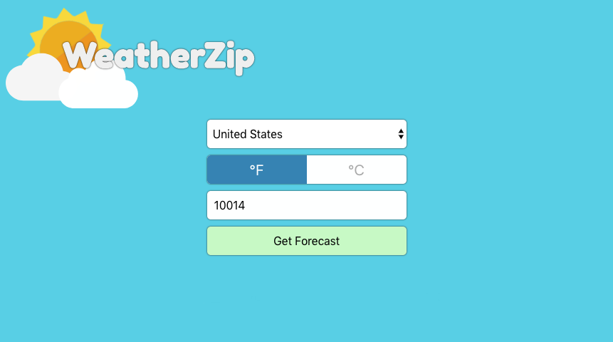
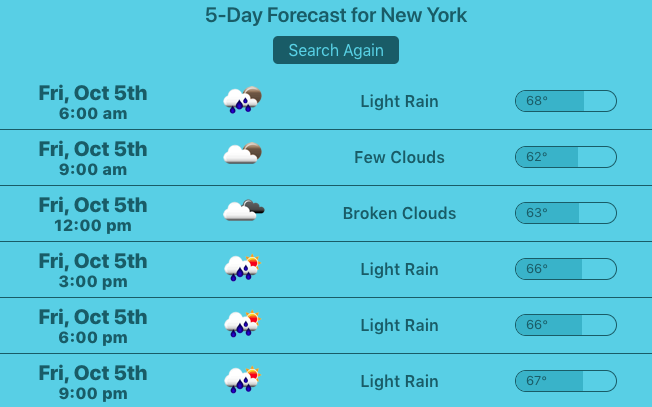

# Weather Zip
A simple web app that uses the [Open Weather Map](https://openweathermap.org/) API.

[View live](http://weatherzip.danflorio.com)

This project was bootstrapped with [Create React App](https://github.com/facebook/create-react-app).

## Development setup
1. Clone the repo
2. `cd` into the project directory, then run `npm install`.
3. Run the development server with `npm start`.
